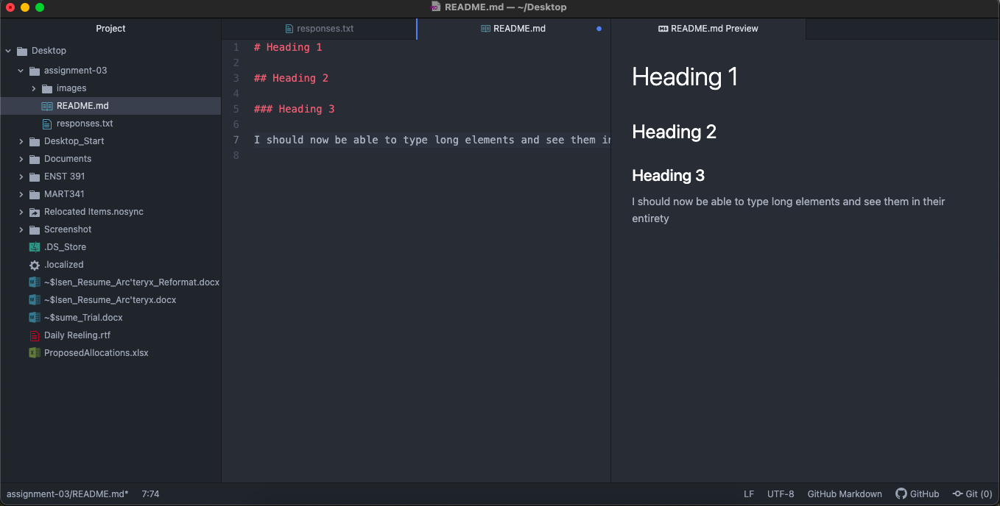

# Assignment 3
## John Nilsen
### Three things I've learned so far:
1. An extensive underwater cable infrastructure connects the world by communicating binary via light
2. Basic understanding of what TCP is and how it works
3. IPv6 is being introduced – it provides a staggering amount of unique IP Addresses

### Additional README Prompts
   1. [Seattle Craigslist Jobs](https://seattle.craigslist.org/search/jjj)

   2. [responses.txt](../assignment-03/responses.txt)

   3. 
   
