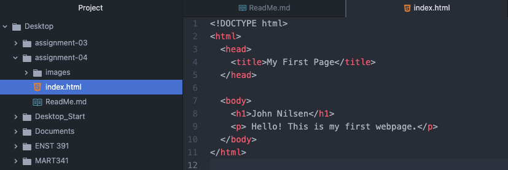

## ReadMe Qs
1. Browsers function by interpreting and displaying HTML and CSS documentation. With the help of a number of components – rendering engine, browser engine, JavaScript interpreter, among others – the web browser is able to parse data and present content for the user. I currently use Chrome and Safari as my default browsers. I use Safari exclusively on mobile.

2. A markup language provides instruction on a webpage’s assembly (most often its text). XML is a markup language that defines and describes data. While an XML document does not “run,” its contents specify how information should be structured.

3. 
