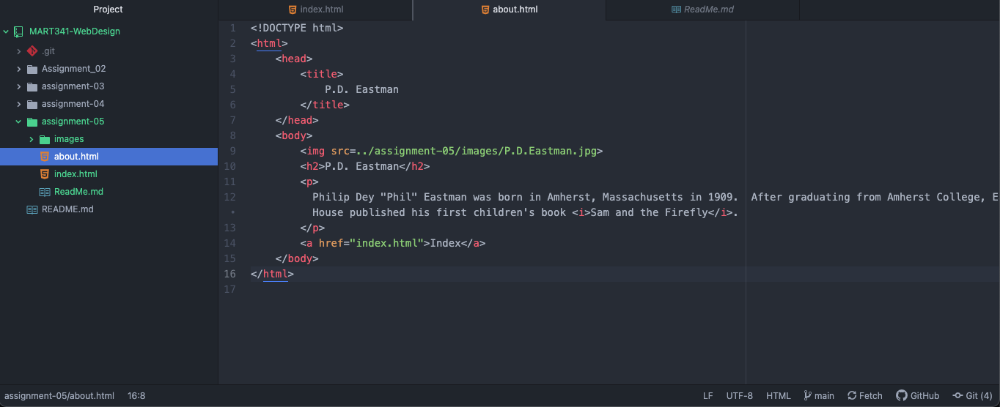

## ReadMe Qs
1. Using The Wayback Machine, I visited my hometown newspaper – the *Star Tribune*. The headings, ads, and links were stark and simple in nature. In juxtaposing today’s startribune.com with a capture from the late 90s, the difference in design elements are profound. While the bones are similar (forecast, sports, variety), the current site boasts exceedingly integrated and fluid functionality.

2. I am learning about web design workflow, file hierarchy, and document elements (to name a few). I have found file management and application integration to be most difficult. While I have not had any serious hangups, it is a little stressful keeping track of where files, folders, and projects belong. Additionally, I am wrestling with employing the correct application given its function – i.e. Atom for editing, GitHub Desktop for publishing, GitHub Pages for hosting, etc.

3. 
